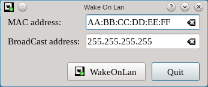

# Wakeonlan

This is a widget that I use for wakeonlan on my local network. Made with C++14 and QT5

Author: Fernando B. Giannasi

# Build and run
    qmake-qt5
    make
    sudo make install
    wakeonlan

